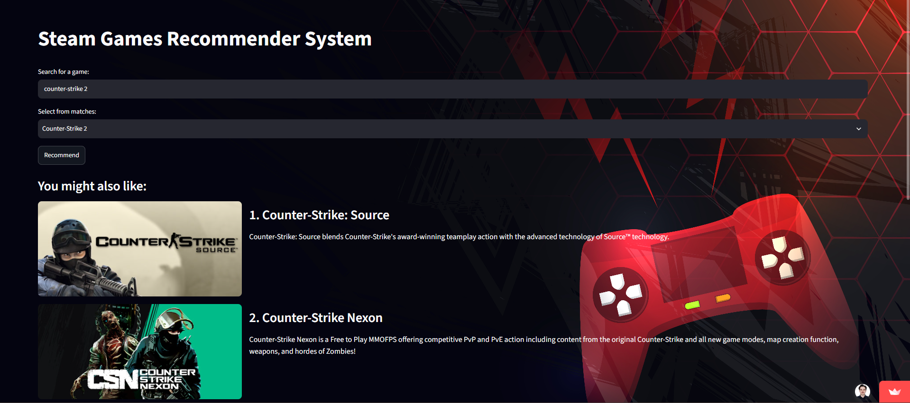

# Steam Games Recommendation System

Pick a Steam game and get 5 similar games, based on their descriptions, tags and popularity.
Built as my Bachelor's thesis at Babeș-Bolyai University (2026).

I've played on Steam for years and often struggled to find new games I'd like, so I built this for my thesis.

**[Try the live app](https://steam-games-recommendation-system.streamlit.app/)**



## How it works

1. **Collect the data.** 82,892 games were fetched from the [SteamSpy API](https://steamspy.com/api.php) (owners, ratings, playtime, tags) and the Steam Store API (descriptions, images), and 81,160 remained after cleaning. Requests are rate-limited, and progress is saved every 100 games.
2. **Clean the text.** HTML tags are removed, non-English descriptions are detected with `langid` and translated to English, and stop words are dropped. Words are reduced to their base form with spaCy (lemmatization: "running" → "run").
3. **Measure similarity.** Each game's tags and cleaned description are turned into a TF-IDF vector. Similarity between two games is the cosine similarity of their vectors.
4. **Score and rank.** Text similarity is combined with a popularity score, so the results favor games that are both similar to the chosen one and liked by others:

```
popularity = 0.2 × positive ratings % + 0.7 × number of owners + 0.1 × median playtime   (each scaled to 0–1)
score      = 0.75 × text similarity + 0.25 × popularity
```

Owners and median playtime are log-scaled before scaling to 0–1, because a few games have over 100 million owners while most have around 10,000.

The thesis version used 0.3 × text similarity + 0.7 × popularity with raw owner counts. That recommended the same 5 popular games for every input and scored about the same as just recommending the most popular games. Log-scaling the owners and tuning the weights on a separate set of 1,000 users fixed this.

The 5 games with the highest score are recommended, excluding the selected game itself.

## Evaluation

The recommender was evaluated offline with **Recall@K** on real Steam user reviews from the Kaggle dataset [Game Recommendations on Steam](https://www.kaggle.com/datasets/antonkozyriev/game-recommendations-on-steam).

- 100 random users with at least 20 positively reviewed games (fixed random seed, so results can be reproduced)
- For each user, one liked game is the input and another liked game is the target
- A hit means the target appears in the top K recommendations

| Version | Recall@5 | Recall@50 | Recall@500 | Recall@5000 |
|---|---|---|---|---|
| Popularity only (baseline) | 1% | 7% | 36% | 36% |
| Thesis version (0.3 / 0.7, raw owners) | 1% | 9% | 25% | 45% |
| **Current (0.75 / 0.25, log-scaled)** | 0% | 5% | 34% | **79%** |

The current version finds the target in the top 5,000 for 79% of users, compared to 36% for the baseline, and recommends different games for different inputs. 

By searching only 6% of the catalog (the top 5,000 of 81,160 games), the current version finds a game the user actually liked for 79% of users.
## Tech stack

- **Language:** Python
- **Data:** pandas, NumPy, requests
- **NLP:** NLTK, spaCy, BeautifulSoup, langid, deep-translator
- **Machine learning:** scikit-learn (TF-IDF, cosine similarity, MinMaxScaler)
- **Web app:** Streamlit (deployed on Streamlit Community Cloud)

## Project structure

```
├── web_application.py      # Streamlit app (the user interface)
├── game_recommender.py     # The recommender: TF-IDF, popularity score, ranking
├── notebooks/              # Data pipeline used for the thesis, run in numbered order
│   ├── fetching-data/            # 1–5: download games from SteamSpy and the Steam API
│   ├── cleaning-data/            # 1–7: HTML removal, translation, cleaning, deduplication
│   └── preparing-testing-data/   # 1–4: prepare the user reviews for evaluation
├── testing/                # Offline evaluation (Recall@K)
└── data/                   # Datasets for each pipeline stage (stored with Git LFS)
```

The notebooks are the exploratory pipeline used during the thesis. The app only needs `data/13_steam_games_final.csv`.

## Run locally

Requires Python 3.10+ and [Git LFS](https://git-lfs.com/). The data files (about 3.5 GB in total) are stored with
Git LFS, so the commands below skip them during the clone and then download only the one file the app needs.

```bash
GIT_LFS_SKIP_SMUDGE=1 git clone https://github.com/razvansfechis/steam-games-recommendation-system.git
cd steam-games-recommendation-system
git lfs pull --include="data/13_steam_games_final.csv"
pip install -r requirements.txt
streamlit run web_application.py
```

On Windows PowerShell, replace the first line with:
`$env:GIT_LFS_SKIP_SMUDGE=1; git clone https://github.com/razvansfechis/steam-games-recommendation-system.git`

## Limitations

- **Item-based:** recommendations come from a single selected game, not from a user's whole library.
- **Weak top-of-list ranking:** low Recall@5 and Recall@50, as shown above.
- **Text matching:** TF-IDF matches words, not meaning, so a game can be recommended just because it shares a word in its name (e.g. "Ring" for Elden Ring).
- Games are matched by name, so two games with the same name can be confused.
- The evaluation has only a popularity baseline, and the input and target games are not picked by review date.

## Next steps

- Report more metrics (NDCG, coverage) and evaluate on more users
- Import a user's Steam library for personalized recommendations
- Try sentence embeddings next to TF-IDF and compare the results
- Rebuild as a full-stack app: a REST API, a React frontend and a database
